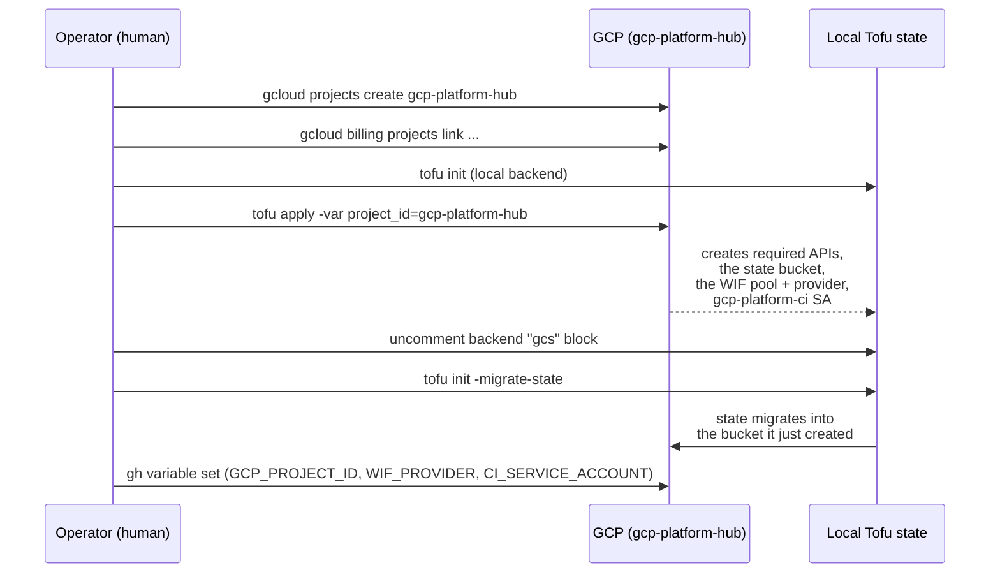
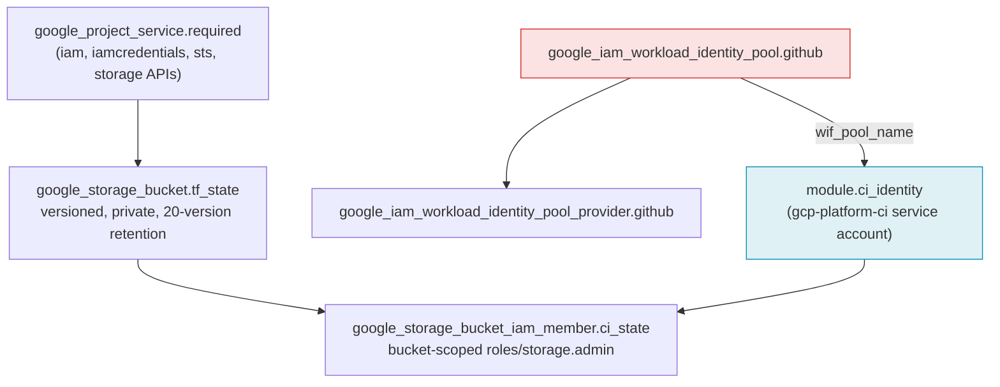

# Bootstrap lifecycle

`bootstrap/` is the one directory in this repo that has a real environment
to apply -- everything else (`modules/`, `examples/`) is validated but never
applied on its own. Bootstrap is also the one part of this repo with a
genuine chicken-and-egg problem: it creates the state bucket it then needs
to store its own state in, and (as of this repo's CI/CD setup) it creates
the CI identity that will apply it from then on.

## First-time setup (local, once)

After migration, every subsequent `bootstrap/` change is applied by CI --
see [CI/CD pipeline](ci-cd.md). A human only needs to run `tofu apply`
locally again if the automated pipeline itself breaks (for example, if the
CI identity's own permissions need fixing -- see the note on
[the privilege this requires](ci-cd.md#the-privilege-this-requires)).

## What `bootstrap/` actually creates

| Resource | Purpose |
|---|---|
| `google_project_service.required` | Enables `iam`, `iamcredentials`, `sts`, `storage` APIs -- the minimum for WIF token exchange and a GCS backend |
| `google_storage_bucket.tf_state` | This repo's own OpenTofu state, versioned (keeps last 20) |
| `google_iam_workload_identity_pool.github` + `..._provider.github` | The shared pool + OIDC provider every repo in the org trusts -- see [Trust model](trust-model.md) |
| `module.ci_identity` | This repo's *own* CI service account (`gcp-platform-ci`), so GitHub Actions can apply future `bootstrap/` changes without a human running `tofu apply` locally |
| `google_storage_bucket_iam_member.ci_state` | Grants `gcp-platform-ci` `roles/storage.admin`, scoped to this one bucket -- never project-wide |

## Why `bootstrap/` never uses `modules/repo-bootstrap`

Every *other* repo's `bootstrap/` calls `modules/repo-bootstrap` to avoid
re-deriving this boilerplate. gcp-platform's own `bootstrap/` can't: it *is*
the thing `repo-bootstrap` depends on (the WIF pool doesn't exist yet the
first time this applies). Its resources are written out directly instead --
see `bootstrap/main.tf` and `bootstrap/wif.tf`.
