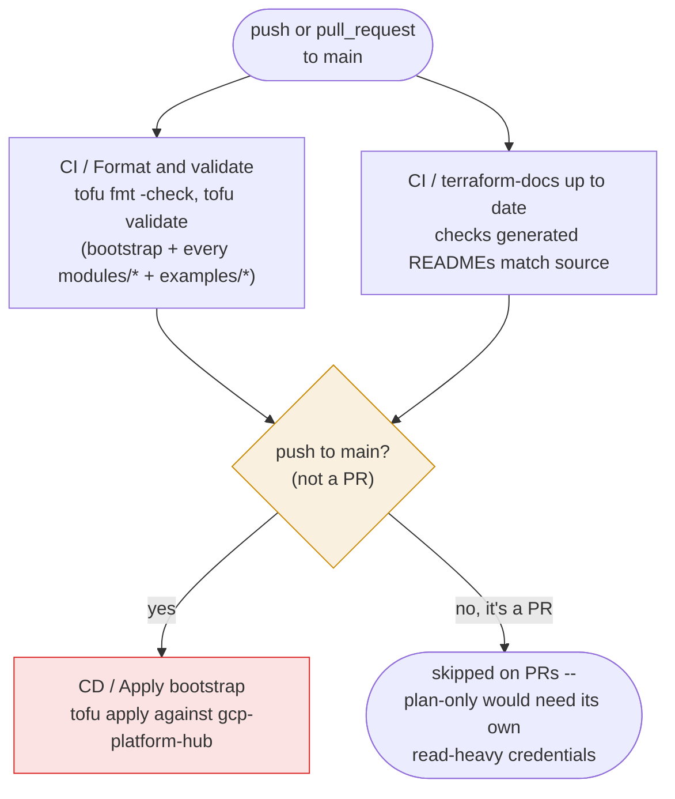

# CI/CD pipeline

A single workflow, `.github/workflows/ci.yml` (workflow name `CI/CD`),
handles both static validation and the real apply.

- **`validate`** and **`terraform-docs`** run on every PR and every push to
  `main`. Neither needs cloud credentials -- `tofu init -backend=false` +
  `tofu validate` needs nothing, and terraform-docs just diffs generated
  markdown against what's committed.
- **`cd`** (job name `CD / Apply bootstrap`) has `needs: [validate,
  terraform-docs]` and an `if:` gate restricting it to
  `github.event_name == 'push' && github.ref == 'refs/heads/main'`. A PR
  never triggers an apply, no matter what it changes.
- All three jobs live in *one* workflow file. An earlier iteration split CD
  into a separate workflow triggered by `workflow_run` off CI's completion
  -- that worked, but needed an explicit `ref: ${{
  github.event.workflow_run.head_sha }}` checkout (workflow_run does not
  check out the triggering commit by default) and a conclusion check
  (`workflow_run` fires on *every* CI outcome, not just success). A same-workflow
  `needs:` dependency gets the identical ordering guarantee with less
  surface area.

## Authentication

CD authenticates as `gcp-platform-ci` via `google-github-actions/auth`,
using the `WIF_PROVIDER` and `CI_SERVICE_ACCOUNT` repo variables (set once,
by hand, right after the SA is created -- see
[Bootstrap lifecycle](bootstrap-lifecycle.md)). No service account key
exists anywhere. No GitHub Actions secret exists either -- these are
non-sensitive repo *variables*, not secrets, matching the pattern every
other repo in the org uses.

## The privilege this requires

!!! warning "gcp-platform-ci can grant any role, including Owner, to anyone on the hub project"
    This is the sharpest edge in the whole repo, worth understanding
    precisely rather than glossing over.

    `bootstrap/main.tf` manages its own IAM bindings as
    `google_project_iam_member` resources -- one per role granted to
    `gcp-platform-ci` itself (self-referential: the identity applying the
    change is also the resource being changed). Every such resource, to be
    *read* (for drift detection) or *changed*, requires
    `resourcemanager.projects.getIamPolicy` / `setIamPolicy` on the whole
    project. No built-in role grants that scoped to specific roles or
    principals -- the only options are `roles/resourcemanager.projectIamAdmin`
    (or broader, like Owner).

    So `gcp-platform-ci` holds `roles/resourcemanager.projectIamAdmin` on
    `gcp-platform-hub`. Its *actual* access boundary is not the roles list
    in `bootstrap/main.tf` -- it's **"who can land a commit on this repo's
    `main` branch."** Anyone who can do that can, transitively, grant
    themselves (or anything) Owner on the hub project via a `bootstrap/`
    change that CD will auto-apply.

    This was granted deliberately, not accidentally discovered in
    production -- see `bootstrap/main.tf`'s comment on the `ci_identity`
    module block for the same explanation kept next to the code. If this
    needs tightening later, the direction is a [delegated role
    grant](https://cloud.google.com/iam/docs/setting-limits-on-granting-roles):
    an IAM Condition on `projectIamAdmin` that restricts *which* roles the
    grantee can itself grant. That wasn't implemented here -- it needs
    careful testing before relying on it for an identity-critical project,
    and was deferred as a known trade-off rather than solved on the spot.

## Two failure modes worth recognizing if this pipeline breaks

**"Error 403: SERVICE_DISABLED" / "iam.serviceAccounts.get denied" right
after the CI identity is first created.** IAM role propagation is eventually
consistent and can take a couple of minutes. If a `tofu plan`/`apply` runs
immediately after granting a brand-new role, retry once real time has
passed before assuming the permission itself is wrong.

**"Saved plan is stale."** Two applies raced (for example, a human running
`tofu apply` locally at the same moment CD is mid-run against the same
state). The GCS backend's locking prevents actual corruption -- this error
just means the plan file's serial number is behind current state. Re-run
`tofu plan` and apply the fresh one.
