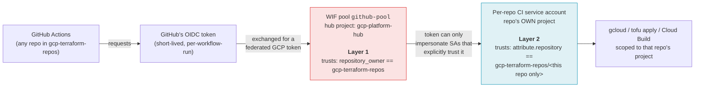

# Trust model

Read this before touching `bootstrap/wif.tf`. Getting this wrong either
locks every repo's CI out, or opens the pool to any GitHub repo on the
internet.

## Two layers, deliberately separate

1. **The pool trusts the org.** `bootstrap/wif.tf`'s `attribute_condition`
   checks `assertion.repository_owner == "gcp-terraform-repos"` and nothing
   more. This is what makes the pool reusable: a brand-new repo never needs
   to touch this hub project to get CI working.
2. **Each repo's actual access is bounded downstream**, in *that repo's own
   project*, by `modules/ci-service-account`'s `workloadIdentityUser`
   binding, which names the specific repository --
   `attribute.repository/gcp-terraform-repos/<repo>`. **This binding is the
   real access boundary, not the pool's condition.**

A pool being org-scoped does not, by itself, let one repo impersonate
another repo's service account. Impersonation requires a matching IAM
binding on that *specific* SA, and each consuming repo's own bootstrap
creates that binding only for itself.

## The two invariants that must never break

!!! danger "Never remove the `repository_owner` check from the pool"
    Without it, any GitHub repo on the internet, in any org, could request
    tokens this pool accepts. The per-SA binding (Layer 2) would still stop
    them from impersonating anything specific -- but it is one guardrail
    you don't want to rely on alone.

!!! danger "Never grant `workloadIdentityUser` with a `principalSet` broader than one repo"
    Unless that is genuinely intended, a wider `principalSet` is the only
    thing standing between "any repo in the org" and "this specific repo."
    Widening it collapses Layer 2 back down to Layer 1's org-wide trust for
    that one service account.

## Why not one pool per repo?

A single shared pool means onboarding a new repo touches *zero* resources
in the hub project (by default, using
[string-passthrough WIF resolution](#two-ways-to-resolve-the-pool)) -- only
two output values get copied. The trade-off, documented as a known
limitation: **one pool total**. If the org ever needs to isolate CI trust
boundaries further -- e.g. a contractor's repo that should never share a
provider with internal repos -- that becomes a second pool + provider here,
not a change to this one.

## Two ways to resolve the pool

`modules/wif-lookup` (used internally by `repo-bootstrap`, and callable
directly) resolves the pool/provider resource names one of two ways:

=== "String passthrough"

    The consumer copies this repo's `wif_pool_name` / `wif_provider_name`
    outputs as plain strings.

    - **Needs no permission on the hub project.**
    - The original, permanently supported design property of this repo --
      never removed.

=== "Data-source lookup"

    The consumer looks the pool up directly via
    `data "google_iam_workload_identity_pool"`, passing `hub_project_id`.

    - Needs `roles/iam.workloadIdentityPoolViewer` (a BETA-stage role)
      granted to whoever runs the consumer's `bootstrap/` on the hub
      project.
    - Convenient when an operator already has that access and doesn't want
      to hand-copy two strings -- but it converts hub availability into a
      hard dependency of every consumer's plan.

Neither is "the" way. Pick per-repo based on whether the operator can be
granted hub read.

## gcp-platform's own CI identity is not special-cased

gcp-platform's CI/CD pipeline (see [CI/CD pipeline](ci-cd.md)) authenticates
through `gcp-platform-ci` -- a service account created by this repo's own
`bootstrap/main.tf`, trusting the very pool that same file manages. It goes
through exactly the same Layer 2 binding every other repo gets, scoped to
`gcp-terraform-repos/gcp-platform` and nothing else. The one difference:
because it manages the pool and its own IAM bindings, it necessarily holds
`roles/resourcemanager.projectIamAdmin` on the hub project -- see the
callout in [CI/CD pipeline](ci-cd.md#the-privilege-this-requires) for what
that actually means.
