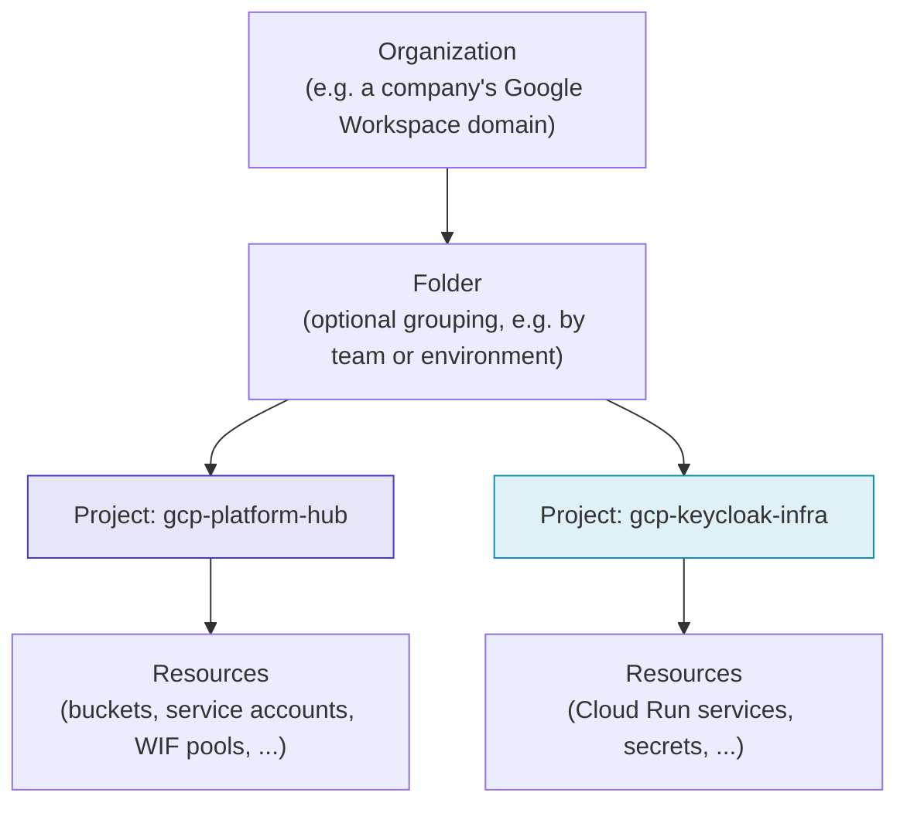
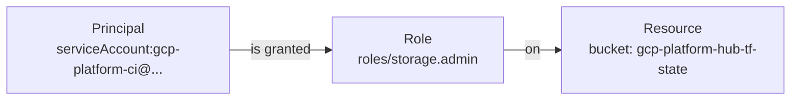
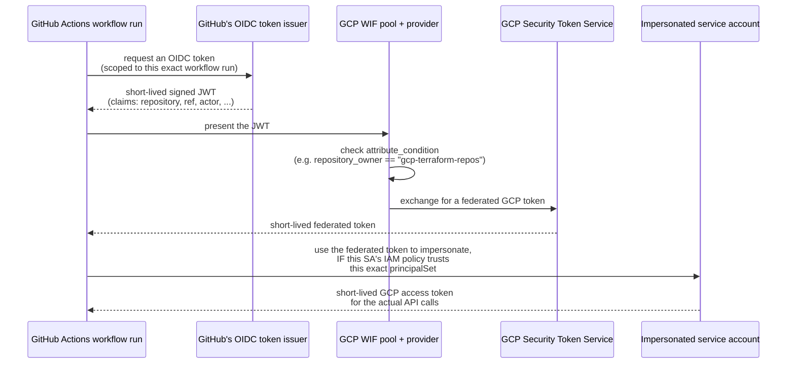

# GCP IAM explained

This page explains the general GCP IAM concepts this repo relies on, from
the ground up. If you already know IAM well, skip to
[Trust model](architecture/trust-model.md) for how this repo specifically
uses it.

## The resource hierarchy

Every IAM policy in GCP is attached to a resource, and resources nest.
Permissions granted higher up are inherited by everything below --
this is why "which project is this in" is always the first question when
debugging an access problem.



This repo's org has no folders in play -- each repo gets its own flat
project, deliberately (see the README's "one project per repo, not shared
runtime infra"). The hub project (`gcp-platform-hub`) holds identity
plumbing only; every consuming repo's project holds its own application
resources and its own CI service account.

## The three questions every IAM binding answers

An IAM binding is always **who** can do **what**, on **which resource**:

| Question | Answered by |
|---|---|
| **Who** | A *principal* -- a user, a service account, a group, or (relevant here) a federated identity via Workload Identity Federation |
| **What** | A *role* -- a named bundle of fine-grained *permissions* (e.g. `roles/storage.admin` bundles `storage.buckets.get`, `storage.buckets.update`, `storage.objects.create`, ...) |
| **Which resource** | The resource the binding is attached to -- a project, a bucket, a single service account, etc. **Scope matters enormously**: the same role means very different things granted at the project level vs. on one specific resource |



This repo's own `google_storage_bucket_iam_member.ci_state` (in
`bootstrap/main.tf`) is exactly this triple: principal =
`gcp-platform-ci`'s service account, role = `roles/storage.admin`, resource
= one specific bucket -- not the whole project.

## Roles: primitive, predefined, custom

- **Primitive roles** (`Owner`, `Editor`, `Viewer`) are broad, pre-GCP-IAM
  holdovers. Almost never the right choice for automation -- this repo
  never uses them.
- **Predefined roles** (`roles/storage.admin`,
  `roles/iam.workloadIdentityPoolAdmin`, `roles/serviceusage.serviceUsageAdmin`,
  ...) are Google-curated bundles scoped to one service or concern. This
  repo uses predefined roles exclusively, chosen to match exactly what each
  Tofu resource needs -- see the `roles = [...]` list in
  `modules/ci-service-account` callers and the extensive comment on
  `gcp-platform-ci`'s own role list in `bootstrap/main.tf`.
- **Custom roles** let you hand-pick individual permissions. Not used in
  this repo -- predefined roles cover everything needed, and custom roles
  are one more thing to keep in sync with GCP's own permission changes over
  time.

## Service accounts

A service account is an identity for a *workload*, not a person. It has:

- an **email** (its identifier, e.g.
  `gcp-platform-ci@gcp-platform-hub.iam.gserviceaccount.com`)
- **roles granted to it** (what it can do to GCP resources -- the
  "downstream" direction)
- an **IAM policy on itself** (who can *impersonate* or otherwise act as
  it -- the "upstream" direction, e.g. `roles/iam.workloadIdentityUser`)

Those two directions are easy to conflate. `modules/ci-service-account`
keeps them as two distinct resources:
`google_service_account_iam_member.workload_identity` (upstream: who can
become this SA) and `google_project_iam_member.ci` (downstream: what this
SA can do).

## Workload Identity Federation

Traditionally, a workload outside GCP (like a GitHub Actions runner) proves
its identity to GCP with a **service account key** -- a long-lived JSON
credential. Keys are a standing liability: they don't expire on their own,
they're easy to accidentally commit, and a leaked key is a leaked identity
until someone notices and revokes it.

Workload Identity Federation removes the key entirely. Instead, GCP trusts
tokens issued by an external identity provider directly:



Two GCP resources make this work:

- **The pool** (`google_iam_workload_identity_pool`) is a container for
  external identities. It doesn't grant access to anything by itself.
- **The provider** (`google_iam_workload_identity_pool_provider`), inside
  the pool, points at the external issuer (`https://token.actions.githubusercontent.com`
  for GitHub Actions) and defines `attribute_mapping` (which JWT claims
  become GCP-visible attributes, e.g. `assertion.repository` →
  `attribute.repository`) and `attribute_condition` (a CEL expression that
  must be true for a token to be accepted at all).

Everything is short-lived: GitHub's OIDC token is scoped to one workflow
run, and the GCP tokens exchanged from it typically last about an hour.
There is no long-lived secret anywhere in this chain -- which is the entire
point.

### `principalSet` -- the piece that actually restricts access

The pool's `attribute_condition` is a coarse, one-time gate (see
[Trust model](architecture/trust-model.md) for why gcp-platform's is
intentionally org-wide, not repo-specific). The fine-grained restriction
happens on the *service account being impersonated*, via a
`principalSet://` member string:

```
principalSet://iam.googleapis.com/<pool-name>/attribute.repository/gcp-terraform-repos/gcp-platform
```

This says: *any* federated identity from the pool whose `attribute.repository`
equals exactly `gcp-terraform-repos/gcp-platform` may hold
`roles/iam.workloadIdentityUser` on this one service account -- i.e. may
impersonate it. Change the suffix and you change which repo can become
this SA. This is why `modules/ci-service-account`'s
`google_service_account_iam_member.workload_identity` resource is called
out, in that module's own source comment, as **the actual access
boundary** -- not the pool.

## Where this repo puts these pieces

| Concept | Where in this repo |
|---|---|
| WIF pool + provider | `bootstrap/wif.tf` (created once, shared by the whole org) |
| Per-repo service account | `modules/ci-service-account` (called once per consuming repo, in that repo's own project) |
| `principalSet` binding | `google_service_account_iam_member.workload_identity`, inside `modules/ci-service-account` |
| Predefined roles granted to a CI identity | The `roles` list passed into each `ci-service-account` / `repo-bootstrap` call |
| Bucket-scoped (not project-wide) grant | `google_storage_bucket_iam_member.ci_state` in both `bootstrap/main.tf` and `modules/repo-bootstrap` |
