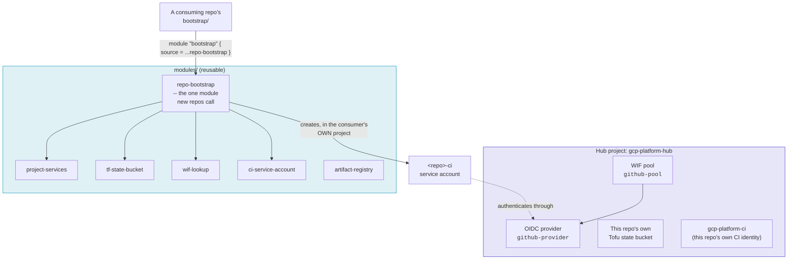

# gcp-platform

**gcp-platform** is the shared identity layer for every repository under the
[`gcp-terraform-repos`](https://github.com/gcp-terraform-repos) GitHub
organization. It exists to answer one question, once, for the whole org:

> How does a GitHub Actions workflow in *any* of our repos authenticate to
> GCP, without anyone ever generating, storing, or rotating a service
> account key?

The answer is one [Workload Identity Federation](gcp-iam.md#workload-identity-federation)
(WIF) pool, hosted in a dedicated **hub project**, that every repo's CI trusts
through the same OIDC provider. This repo holds no application
infrastructure -- no Cloud Run services, no databases, nothing that serves
traffic. It is pure identity plumbing, plus the OpenTofu state bucket that
backs its own configuration.

## Why this exists

Before this repo, every new GCP-backed repo in the org had to either:

- generate a long-lived service account key and paste it into GitHub
  Secrets (a standing credential that never expires on its own and is
  catastrophic if leaked), or
- hand-roll its own WIF pool from scratch -- OIDC provider, attribute
  mapping, attribute condition, the works -- and get the trust boundary
  subtly wrong in a way that isn't obvious until an audit or an incident.

gcp-platform collapses that into one hub-level resource (the pool) plus one
reusable module (`ci-service-account`) that any repo calls to get a
correctly-scoped CI identity in *its own* project, in about ten lines of
Tofu.

## The one-sentence trust model

The pool trusts the **org**; each repo's own service account binding trusts
**that one repository, and only that repository**. See
[Trust model](architecture/trust-model.md) for the full picture, including
why that split is deliberate and what it does and doesn't protect against.

## What's in this repo

| Path | What it is |
|---|---|
| `bootstrap/` | Applied once, locally: required APIs, this repo's own state bucket, the WIF pool + provider, and this repo's own CI identity (`gcp-platform-ci`) |
| `modules/repo-bootstrap` | The one module a new repo's `bootstrap/` should call |
| `modules/ci-service-account` | Lower-level: just a repo-scoped CI service account, if a repo wants to compose its own bootstrap |
| `modules/project-services`, `tf-state-bucket`, `wif-lookup`, `artifact-registry` | Focused, reusable building blocks that `repo-bootstrap` composes |
| `examples/new-repo-bootstrap/` | A complete, runnable example of onboarding a new repo |

## Where to go next

- New to this repo? Read [Trust model](architecture/trust-model.md) first --
  it explains the security boundary everything else here depends on.
- Onboarding a new repo to use this platform? Go straight to
  [Onboarding a new repo](onboarding.md).
- Don't know GCP IAM well? [GCP IAM explained](gcp-iam.md) covers the
  concepts this repo leans on -- projects, service accounts, roles,
  bindings, and Workload Identity Federation itself -- from the ground up.
- Curious how a change here actually reaches the hub project?
  [CI/CD pipeline](architecture/ci-cd.md) walks through the automated
  apply.
