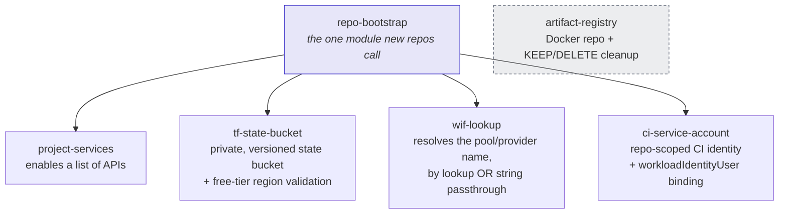

# Module reference

Every module here has its own terraform-docs-generated `README.md`
(checked for staleness by CI on every PR) with the full input/output
tables. This page is the map of how they compose -- see each module's own
README (linked below) for exact variables.

`artifact-registry` is not composed into `repo-bootstrap` -- it's called
standalone by repos that need a Docker registry (not every repo does).

## repo-bootstrap

**The single module a new repo's `bootstrap/` should call.** Composes
`project-services` + `tf-state-bucket` + `wif-lookup` + `ci-service-account`
so a new repo does not re-derive ~80 lines of boilerplate by copy-paste.

[Full reference on GitHub &rarr;](https://github.com/gcp-terraform-repos/gcp-platform/tree/main/modules/repo-bootstrap)

Outputs include a ready-to-run `github_variables_command` -- see
[Onboarding a new repo](onboarding.md) for the full flow this feeds into.

## ci-service-account

A CI service account, in the **consuming repo's own project**, that
authenticates via the shared WIF pool but is impersonable only by that
repo's GitHub Actions workflows. Never touches the hub project --
`wif_pool_name` is consumed as an opaque string, not looked up.

[Full reference on GitHub &rarr;](https://github.com/gcp-terraform-repos/gcp-platform/tree/main/modules/ci-service-account)

This is what gcp-platform's own `bootstrap/main.tf` calls for its own
`gcp-platform-ci` identity -- see
[Bootstrap lifecycle](architecture/bootstrap-lifecycle.md).

## project-services

Enables a set of GCP APIs on a project. Extracted from the
near-identical `google_project_service` block that used to be copy-pasted
into every repo's `bootstrap/`.

[Full reference on GitHub &rarr;](https://github.com/gcp-terraform-repos/gcp-platform/tree/main/modules/project-services)

## tf-state-bucket

A private, versioned GCS bucket for one repo's own OpenTofu state. The
free-tier region validation (`us-east1` / `us-west1` / `us-central1` only)
lives here once, instead of being duplicated into every repo's
`variables.tf`.

[Full reference on GitHub &rarr;](https://github.com/gcp-terraform-repos/gcp-platform/tree/main/modules/tf-state-bucket)

## wif-lookup

Resolves the shared WIF pool + provider resource names, via either of the
two mutually exclusive paths described in
[Trust model &sect; Two ways to resolve the pool](architecture/trust-model.md#two-ways-to-resolve-the-pool).

[Full reference on GitHub &rarr;](https://github.com/gcp-terraform-repos/gcp-platform/tree/main/modules/wif-lookup)

## artifact-registry

A Docker Artifact Registry repository with a KEEP/DELETE cleanup policy.
Promoted from `gcp-keycloak-infrastructure`, which needed a tight
`keep_versions` cap to fit inside the 0.5&nbsp;GB Artifact Registry free
allowance. That number stays a call-site decision (this module's default
is wider) rather than a module-wide constraint, since it's a fact about one
consumer's image size, not about artifact registries in general.

[Full reference on GitHub &rarr;](https://github.com/gcp-terraform-repos/gcp-platform/tree/main/modules/artifact-registry)

## Releasing a new module version

1. Change whichever `modules/` the release touches.
2. `tofu fmt -recursive` + validate everything.
3. Note the change in `CHANGELOG.md`.
4. Tag: `git tag vX.Y.Z && git push origin vX.Y.Z`.
5. Update the `?ref=` in each consuming repo **deliberately, one at a
   time** -- this is the safety valve versioning buys you.
